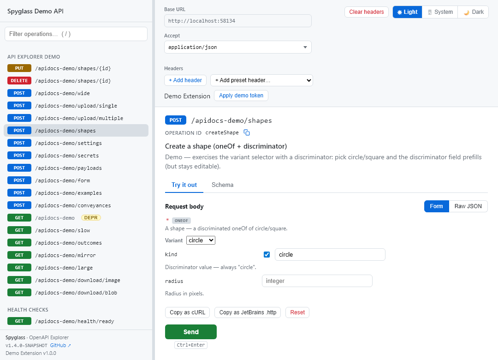

# Spyglass

**An embeddable, no-build OpenAPI explorer for Spring Boot.**

[](https://central.sonatype.com/artifact/org.plukh.spyglass/spyglass-spring-webmvc)
[](https://github.com/vdenisov/spyglass/actions/workflows/ci.yml)
[](LICENSE)
[](#compatibility)
[](https://spyglass-demo.fly.dev/apidocs)

Spyglass renders a service's OpenAPI 3.x document as browsable, executable API documentation and ships
as a normal jar. Add one dependency and it replaces Swagger UI as your service's API docs page, served
from your own origin — no npm, no bundler, no build step.

<picture>
  <source media="(prefers-color-scheme: dark)"  srcset="docs/assets/explorer-dark.png">
  <source media="(prefers-color-scheme: light)" srcset="docs/assets/explorer-light.png">
  
</picture>

## Why

Swagger UI is everywhere and trivial to turn on — it's a Spring Boot default. The problem is, its
"Try it out" hands you a raw-JSON textarea: there's no schema-driven form (typed
fields, enums as selects, `oneOf`/`anyOf` variant pickers), and even for plain JSON you get no help —
no schema validation, no autocomplete, no inline errors. And bending it to your environment — your own
auth UI, header presets, trace deep-links — means fighting a bundled single-page app.

Spyglass targets exactly those gaps: a schema-driven request form, a
[CodeMirror](https://codemirror.net) Raw-JSON editor with live schema validation and autocomplete, and
a documented extension seam. It's a modern, lightweight explorer **vendored as static ESM**
([Vue](https://vuejs.org), [marked](https://marked.js.org), and a pre-built CodeMirror bundle) and
served straight from the classpath — the consuming service just adds a dependency.

It is deliberately scoped to the **one** service it's embedded in — it documents and exercises that
service's own API, not a fleet. No proxy, no gateway, no service catalog.

**At a glance — Spyglass vs Swagger UI:**

| | Swagger UI | Spyglass |
| --- | --- | --- |
| Request body ("Try it out") | Raw JSON textarea pre-filled with an example; `oneOf`/`anyOf`/`discriminator` unions appear only in a read-only **Schema** tab — no variant picker | Schema-driven form: typed fields, enum selects, `oneOf`/`discriminator` variant picker, multipart & urlencoded forms — with per-field recent-value recall |
| JSON editing | Plain textarea; no client-side payload validation (validates the spec, not your request body) | CodeMirror 6 with live JSON-Schema validation, inline errors, and schema-aware autocomplete |
| Request history | None — each "Try it out" is transient; only authorization can persist (`persistAuthorization`) | Per-operation Request Log: browse, replay, and delete past request+response pairs; survives reload |
| Build & extend | Bundled SPA (`swagger-ui-bundle.js`); plugin system, usually a JSX build; internal APIs aren't a stable contract | Static ESM app, no build to theme or extend; documented `register(api)` seam (auth panel, header presets, request/response transformers) |
| How it's served | From the springdoc swagger-ui webjar at `/swagger-ui.html` | From your service's own classpath, same origin |

Swagger UI still leads where Spyglass won't follow: its ubiquity and zero-config springdoc default,
and full OAuth2 authorization-code (redirect) flows, which sit outside Spyglass's static,
same-origin charter. A couple of its other conveniences — a built-in Authorize panel for standard
`securitySchemes`, and shareable request deep-links — are on the Spyglass roadmap too.

## What you get

- Operation browsing with a filterable, keyboard-navigable sidebar; deprecated-operation indicators.
- A schema-driven request-body form: objects, arrays, enums, `oneOf`/`anyOf`/`discriminator` variant
  selectors, and non-JSON bodies (`multipart/form-data`, `application/x-www-form-urlencoded`).
- A Raw-JSON editor (CodeMirror 6) with live schema validation; required-field warnings that don't
  block sending.
- Same-origin "try it out", content-type-aware response rendering, named examples, request history,
  persisted UI state, `curl` / JetBrains `.http` snippet generation, markdown descriptions, and
light/dark theming.
- Trace-header deep-links via a vendor-neutral response-header link resolver hook.
- A documented front-end **extension seam** so an embedding service can contribute its own UI (auth
  panels, header presets, header-link resolvers, response-body transformers) without forking the core.

## Quick start

Add the adapter for your web stack (and a springdoc starter, if your service doesn't already have one).

**Servlet (Spring MVC):**

```xml
<dependency>
  <groupId>org.plukh.spyglass</groupId>
  <artifactId>spyglass-spring-webmvc</artifactId>
  <version>1.4.0</version>
</dependency>
```

```java
@Configuration
@Import(org.plukh.spyglass.spring.webmvc.SpyglassConfiguration.class)
class ApiDocsConfig {}
```

**Reactive (WebFlux):**

```xml
<dependency>
  <groupId>org.plukh.spyglass</groupId>
  <artifactId>spyglass-spring-webflux</artifactId>
  <version>1.4.0</version>
</dependency>
```

```java
@Configuration
@Import(org.plukh.spyglass.spring.webflux.SpyglassConfiguration.class)
class ApiDocsConfig {}
```

springdoc generates `/v3/api-docs` from your controllers; Spyglass serves the explorer at **`/apidocs`**.

> **Activation styles.** Both adapters use the explicit `@Import` style above — no
> `AutoConfiguration.imports` / `spring.factories` ships in these jars, so nothing activates until you
> ask for it. A separate extension can layer an auto-registering shim on top (so its consumers get the
> explorer with zero code); see [`docs/quick-start.md`](docs/quick-start.md).

## Try it

**Live demo: <https://spyglass-demo.fly.dev/apidocs>** — an always-on instance where "Try It Out"
executes real (same-origin) requests against a set of toy endpoints.

Or run the same showcase locally:

```bash
mvn -pl spyglass-demo -am clean install -DskipTests=true
mvn -pl spyglass-demo spring-boot:run
# then open http://localhost:8080/apidocs
```

Its toy endpoints exercise every front-end feature: `oneOf`/`anyOf`/`discriminator` bodies, named
examples, multipart/urlencoded uploads, image/binary responses, and a deprecated operation. It also
ships a small, self-contained [sample extension](docs/extension-seam.md) that auto-loads from the
spec — the worked example the extension docs build on.

## Modules

| Module | What it is |
| --- | --- |
| `spyglass-core` | Framework-neutral front end: the static Vue/ESM app + CodeMirror bundle. No server code. |
| `spyglass-spring-core` | Stack-neutral Spring wiring: the additive springdoc `OpenApiCustomizer`. |
| `spyglass-spring-webmvc` | The servlet (Spring MVC) adapter: the `SpyglassConfiguration` entry point + friendly redirects. |
| `spyglass-spring-webflux` | The reactive (WebFlux) adapter: the reactive `SpyglassConfiguration` twin + `RouterFunction` redirects. |
| `spyglass-spring-test-support` | The shared Playwright browser-spec harness, for adapter and extension test authors. |
| `spyglass-demo` | A runnable showcase app (above). |

## Configuration & extension

The front end resolves its runtime config through a fixed precedence chain — URL query parameter →
`window.SPYGLASS_CONFIG` → built-in defaults — covering the spec URL, a `localStorage` namespace, and
the extension-module list. Extensions are ESM modules exporting `register(api)`; the explorer discovers
them via `?ext=`, `window.SPYGLASS_CONFIG.extensions`, or the spec's `x-spyglass-extensions` `info`
extension, and loads them into the same app instance.

See the reference docs:

- [Quick start](docs/quick-start.md) — the minimal happy path per activation style and web stack.
- [Configuration](docs/configuration.md) — the `config.js` precedence chain and the `x-*` `info`-extension catalog.
- [Extension seam](docs/extension-seam.md) — the `register(api)` contract, with the demo's sample extension as a worked example.
- [Adapter contract](docs/adapter-contract.md) — what any framework adapter must provide.

## Compatibility

Both build legs are verified in CI (unit + Playwright browser specs):

| | Supported |
| --- | --- |
| Java | 21+ |
| Spring Boot | 3.5 (springdoc 2.x) and 4.1 (springdoc 3.x) |
| Web stack | servlet (Spring MVC) and reactive (WebFlux) |

The springdoc compatibility seam targets the springdoc-**common** `OpenApiCustomizer` SPI and the
`io.swagger.v3.oas.models` object model, both stable across the two majors.

## Status

**Released** and available on Maven Central. Semantic versioning applies: the public
surface (entry points, `apidocs.*` properties, `config.js` precedence, the `x-*` extension names) stays
stable across the 1.x line.

## Contributing

See [`CONTRIBUTING.md`](CONTRIBUTING.md) — building both legs, running the browser specs, and the
front-end CodeMirror bundle build.

## License

[MIT](LICENSE). The vendored front-end code — Vue, `marked`, and the CodeMirror bundle's
dependencies — is attributed in
[`spyglass-core/frontend/THIRD-PARTY-NOTICES.txt`](spyglass-core/frontend/THIRD-PARTY-NOTICES.txt),
which is also shipped inside the `spyglass-core` jar under `META-INF/`.
